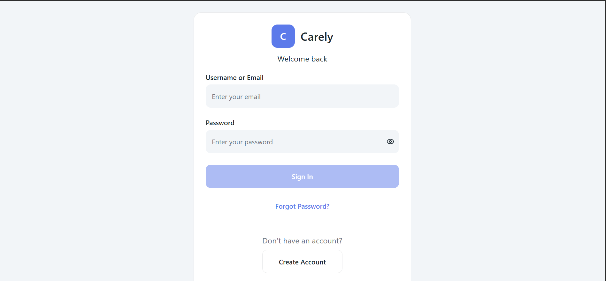
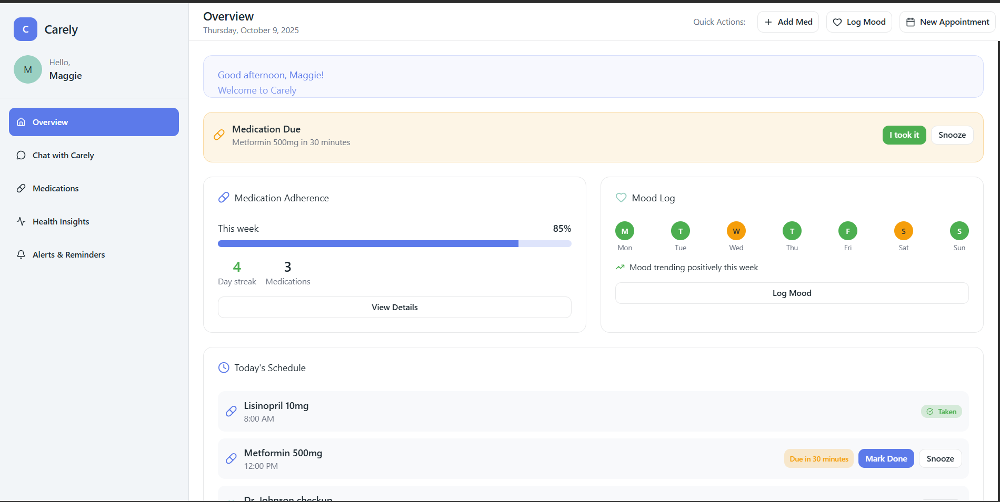
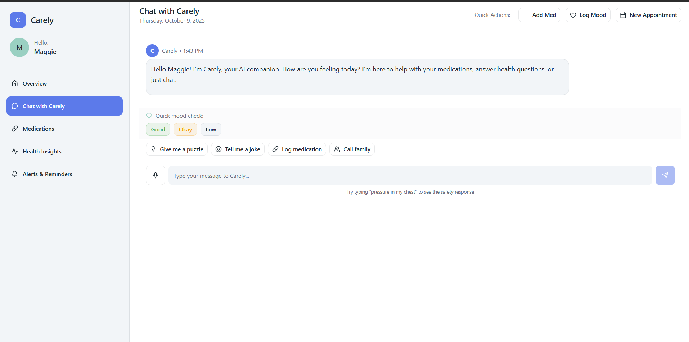
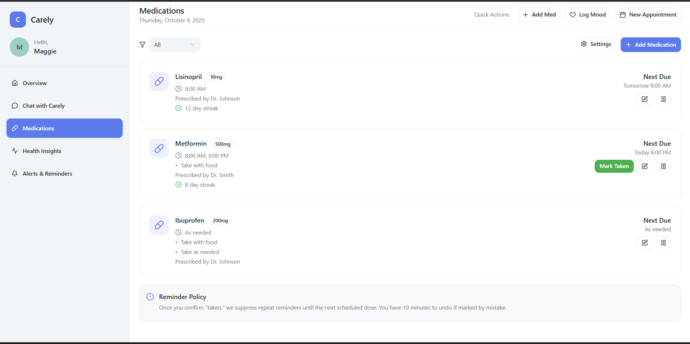
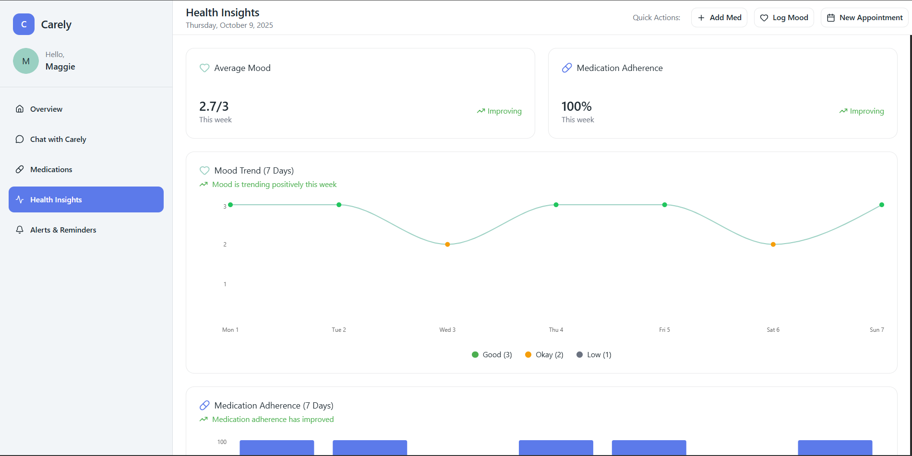
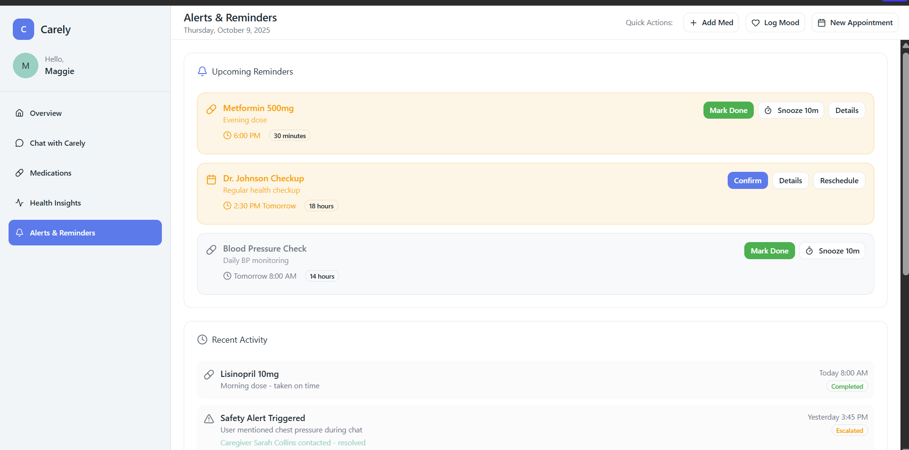

# Carely Prototype

[Here is our Carely Prototype](https://alone-radar-48376815.figma.site/)

## 🎨 Carely Interface Overview

### User login page

The primary login page for users.

### Overview dashboard

The overview of today's schedule, daily check-in, upcoming medication reminders, mood logs.

### Chat with Carely dashboard

The conversation interface of Carely, with quick action buttons embedded.

### Medications dashboard

The dashboard displaying user's medication schedule, log(mark as Taken) and related details.

### Health Insights

The interface showing overall mood trend, medication adherence for a week.

### Alerts & Reminders

The dashboard displaying user's upcoming appointments, test reminders and recent activity.

